# HiveNavigator — acoustic & sensor analysis of queenright vs. queenless bee colonies

## context

HiveNavigator is an automated hive monitoring platform that detects biologically significant colony events
— queen loss, swarming, parasite pressure — from a continuous stream of acoustic, vibration,
and environmental sensor data.

This analysis focuses on a **controlled queen-removal experiment** conducted in March 2026.
Two hives underwent queen manipulation while the others served as undisturbed controls.
The goal is to characterise how acoustic and vibrational signatures change when a colony loses its queen,
and to build an anomaly detector that can flag queenless states automatically.

---

## the experiment

The experiment began on 7 March 2026.
There are 11 hives numbered from 1 to 11.
The first 6 hives are considered to host active bee colonies.

The queen was absent (removed) during certain periods in particular hives:

| hive    | queen status                                    | notes                                              |
|---------|-------------------------------------------------|----------------------------------------------------|
| hive 03 | queenless from 12 March onward                  | queen removed on 12 March                          |
| hive 04 | queenless 9–12 March, queen introduced 12 March | queen was absent, then a queen was introduced      |

---

## data sources

### audio files

Mono FLAC recordings at 16 000 hertz sample rate, two files per hour per hive.
Each file covers approximately 30 minutes of continuous in-hive audio.

### accelerometer

Sampled approximately every 60 seconds.
Seven columns: timestamp, three main fast Fourier transform frequencies (f1, f2, f3)
and their corresponding magnitudes (m1, m2, m3).

### environmental sensors

Sampled every 10 minutes.
Temperature, relative humidity, CO₂ concentration, accelerometer orientation, and Wi-Fi signal strength.

---

## audio feature extraction pipeline

For each audio file, interpretable spectral features are computed over short analysis frames
and aggregated into a single feature vector representing that hour.

### preprocessing

Each ~30-minute audio segment passes through two stages before feature extraction:

1. **spectral amplitude subtraction** — a minimum-statistics noise estimator identifies
   the 20 quietest short-time Fourier transform frames, averages their power spectra to form a noise profile,
   and subtracts that profile from every frame. This suppresses stationary background noise
   while preserving bee-related spectral content.

2. **pre-emphasis filtering** — a first-order high-pass filter (coefficient 0.97)
   boosts higher frequencies that tend to be attenuated during recording,
   improving the resolution of cepstral features in those bands.

The pre-emphasised signal is used for cepstral features (mel-frequency cepstral coefficients,
linear-frequency cepstral coefficients, gammatone cepstral coefficients).
The noise-reduced (but not pre-emphasised) signal is used for all other spectral features.

### framing

The signal is divided into 1-second analysis frames (16 000 samples) with 50 % overlap
(hop length 8 000 samples). A short-time Fourier transform is applied to each frame
to obtain a magnitude spectrogram and the corresponding frequency axis.

### core spectral features

**Spectral shape descriptors** — computed from the magnitude spectrum of each frame:

- **spectral centroid** — frequency-weighted centre of mass of the spectrum
- **spectral bandwidth** — spread of energy around the centroid
- **spectral rolloff** — frequency below which 85 % of total energy is concentrated
- **spectral flatness** — ratio of geometric to arithmetic mean of the power spectrum; high values indicate noise-like content
- **spectral crest** — ratio of peak magnitude to mean magnitude; high values indicate tonal content
- **spectral entropy** — Shannon entropy of the normalised power spectrum; measures how diffuse the energy distribution is
- **spectral skewness** — asymmetry of the spectral shape around the centroid
- **spectral kurtosis** — peakedness of the spectral shape around the centroid
- **spectral flux** — root-mean-square change in the magnitude spectrum between consecutive frames

**Cepstral features** — three complementary filterbank representations, each producing 13 coefficients:

- **mel-frequency cepstral coefficients** — mel-scaled triangular filterbank followed by discrete cosine transform; captures the coarse spectral envelope on a perceptually motivated scale
- **linear-frequency cepstral coefficients** — same pipeline but with a linearly spaced triangular filterbank (26 filters); preserves equal frequency resolution across the spectrum
- **gammatone cepstral coefficients** — ERB-spaced gammatone-shaped filterbank (40 filters); models auditory peripheral filtering more closely than mel or linear spacing

**Pitch and tonality features:**

- **chroma features** — 12-bin pitch-class energy distribution; picks up tonal piping signals
- **dominant frequency tracking** — the three highest spectral peaks per frame, sorted by frequency; tracks the main resonant components over time

**Energy and noisiness features:**

- **root-mean-square energy** — overall loudness envelope
- **zero-crossing rate** — proxy for noisiness and high-frequency content

### hive-specific and band-decomposition features

These features are inspired by the UrBAN beehive acoustics feature set:

- **hive power** — total power in the 122–515 hertz band, which concentrates the fundamental wing-beat frequency and its first harmonic
- **audio band density ratio** — fraction of total power falling in the 122–515 hertz hive band
- **audio density variation** — frame-to-frame change in hive-band power
- **audio band coefficients** — power summed in each of 16 linearly spaced frequency bands spanning the full spectrum

### psychoacoustic frequency bands

Power is also decomposed along three alternative frequency scales:

- **bark bands** — 27 bands on the Bark scale (Traunmüller 1990), approximating critical bands of the mammalian auditory system
- **equivalent rectangular bandwidth bands** — 40 bands on the ERB scale (Glasberg & Moore 1990), providing finer resolution at low frequencies

### spectral contrast

For each of 6 octave-spaced sub-bands (starting at 100 hertz):

- **spectral contrast** — log ratio of the loudest 20 % of bins to the quietest 20 %; measures how peaked vs. flat each sub-band is
- **spectral valley** — log-mean of the quietest 20 % of bins; captures the noise floor per sub-band

### additional spectral descriptors

- **strong peak ratio** — ratio of the single strongest spectral bin to the mean magnitude; detects narrow tonal peaks
- **high-frequency content** — magnitude weighted by bin index, emphasising the upper part of the spectrum

### passband features

Features are also computed per frequency band (low, middle, high passbands)
by bandpass-filtering the audio with a 6th-order Butterworth filter for each band
before extracting root-mean-square energy, spectral centroid, and spectral bandwidth.
Inter-band energy ratios (low-to-middle, low-to-high, middle-to-high) are derived from the passband energies.

### modulation spectrogram

The modulation spectrogram captures how energy in each frequency band fluctuates over time:

1. compute the short-time Fourier transform with a 512-sample window and 256-sample hop to obtain a spectrogram S(t, f)
2. apply a second fast Fourier transform along the time axis of each frequency row → M(ω_m, f)
3. restrict modulation rates to the 1–30 hertz range, where bee-relevant modulations lie
   (wing-beat modulation around the 250 hertz carrier, queen and worker piping, fanning)

For each passband (low, middle, high), two scalars are extracted:
the total modulation energy and the peak modulation frequency.

### aggregation

Each per-frame feature array is collapsed into two scalars — **mean** and **standard deviation** —
across all frames within the file.
For multi-coefficient features (e.g. 13 mel-frequency cepstral coefficients), mean and standard deviation
are computed independently for each coefficient.
Modulation spectrogram features are already scalars and are kept as-is.

The result is one flat feature vector per audio file.
Two files per hour are averaged, producing **one feature vector per hive per hour**.

---

## accelerometry analysis

### data overview

The accelerometer records the three main fast Fourier transform peak frequencies and their magnitudes
every ~60 seconds across 11 hives.

### cleaning steps

1. **kept only the first peak** — peaks 2 and 3 are echoes visible on spectrograms and do not carry additional information
2. **removed structural harmonics** — three narrow fixed frequency bins (~110, ~220, ~330 hertz) identical across all hives including the dummy; assumed to be structural resonance of the sensor or hive body
3. **magnitude threshold of 6** — filters out diffuse noise; keeps only genuine vibration patterns
4. **restricted to daytime hours (8:00–18:00)** — night carries little vibrational information

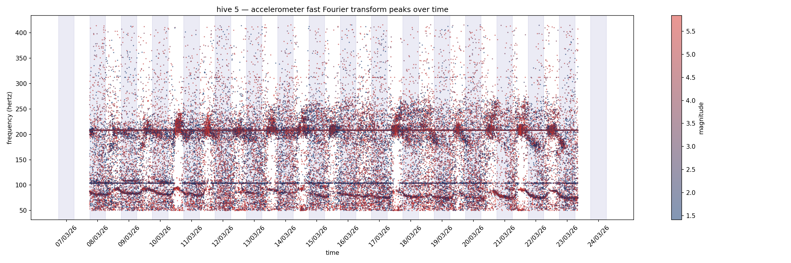

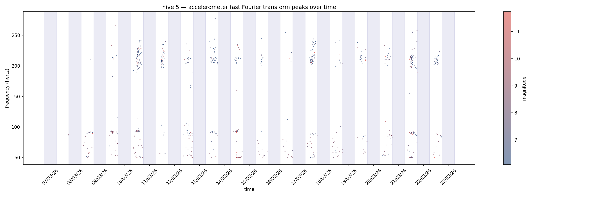

### indicator: daily in-band peak ratio

The explored indicator is the **daily in-band peak ratio**: the fraction of peaks falling in the 50–100 hertz band
versus all frequencies.

The 50–100 hertz band is where active hives concentrate vibrational energy.
The higher band (200+ hertz) is more diffuse and less sharply bounded than the literature suggests.
Comparing 50–100 hertz against everything else captures the balance between these two regimes.

**observations:**

- hive 04 starts with a particularly low ratio and begins to rise around 12 March
- hive 03 follows the opposite trend
- the two curves crossing coincides with the queen being transferred between them

**conclusion:**
this does not appear to be a strong standalone indicator of queenright/queenless state,
neither for intra-hive monitoring nor inter-hive comparison.
However, it may be a useful contributor alongside audio features in a multimodal approach.

---

## environmental sensors

Temperature and humidity are read from the SHT sensor inside each hive.
These values are merged with the audio feature dataframe by timestamp
and included as context features for anomaly detection.

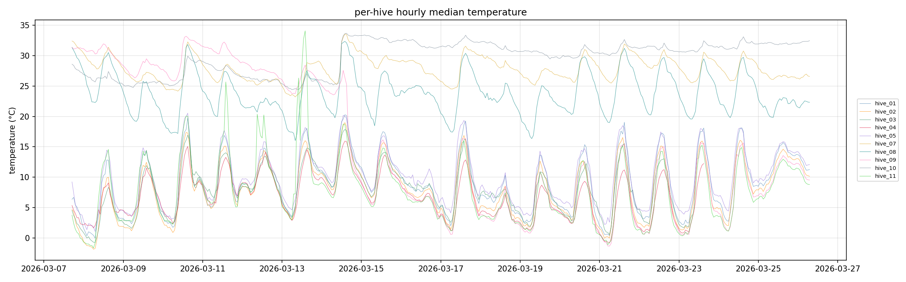

#### aggregated ambient features
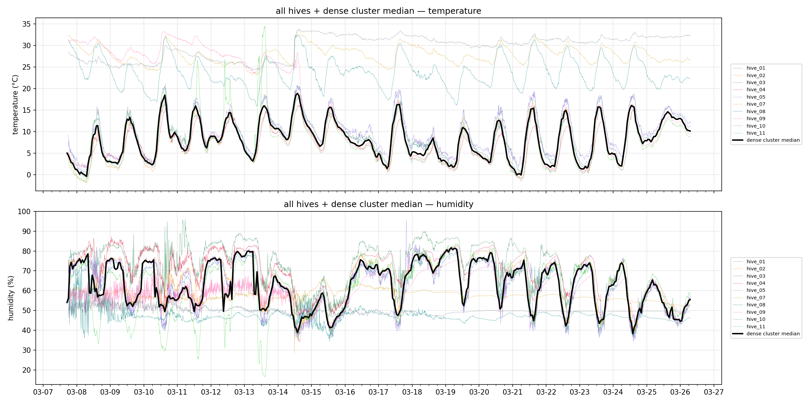

---

## feature merging

All per-hive audio feature dataframes are concatenated, then left-joined with the ambient sensor data
(temperature, humidity) on timestamp. The merged dataframe is the input to anomaly detection.

Each row represents one hour of one hive and contains:
timestamp, hive identifier, time slice, queen state label, all audio features, temperature, and humidity.

---

## anomaly detection

### method

A **one-class support vector machine** is trained on queenright data only (all hives, all hours).
The model learns the "normal" feature envelope; queenless observations are scored as novelty.

**Per-time-slice scoring:** one scaler and one detector are fitted per hour slice,
so the model does not confuse day/night variation with anomaly.

**Feature selection:** features are filtered to keep only those whose median z-score
diverges most between queenright and queenless data.

### focused time slices

Activity is concentrated during daylight.
The analysis focuses on midday slices (11–12, 12–13, 13–14) where bee activity is highest
and the signal-to-noise ratio is best.

### clustering

Principal component analysis is applied to the full feature set to highlight potential groupings,
in particular queenright against queenless data.

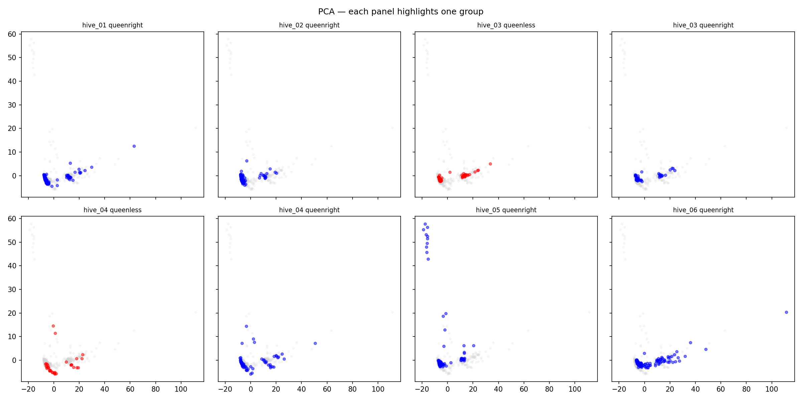

Patterns appear to be more hive-dependent than queenlessness-dependent.

### evaluation

- **anomaly score histograms** — visual check that queenless scores shift left (more anomalous)
- **Mann–Whitney U test + area under the receiver operating characteristic curve** — non-parametric measure of how separable the two populations are
- **Cohen's d** — effect size in pooled standard deviations

#### queenless vs queenright
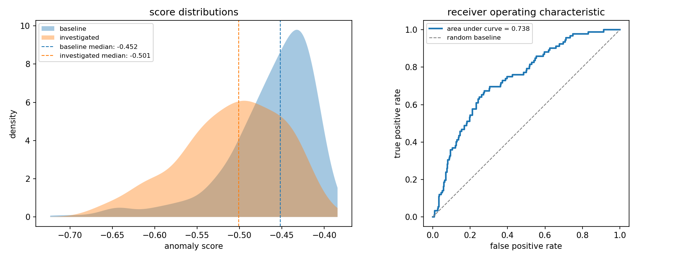
#### queenless hive 03 vs queenright
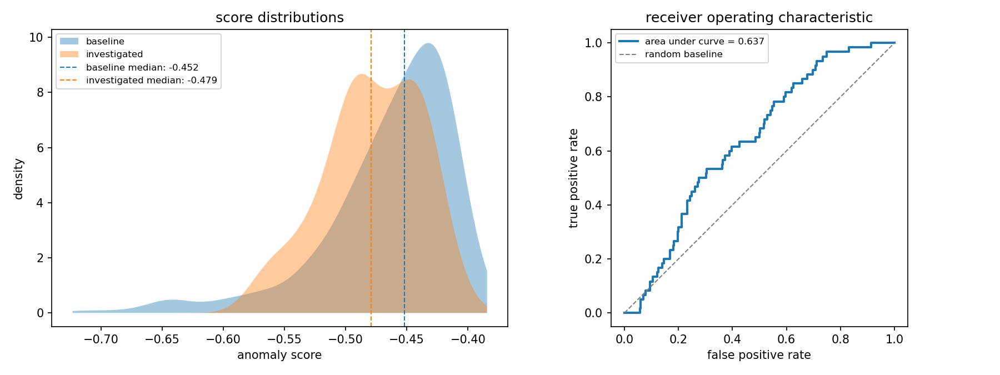
#### queenless hive 04 vs queenright
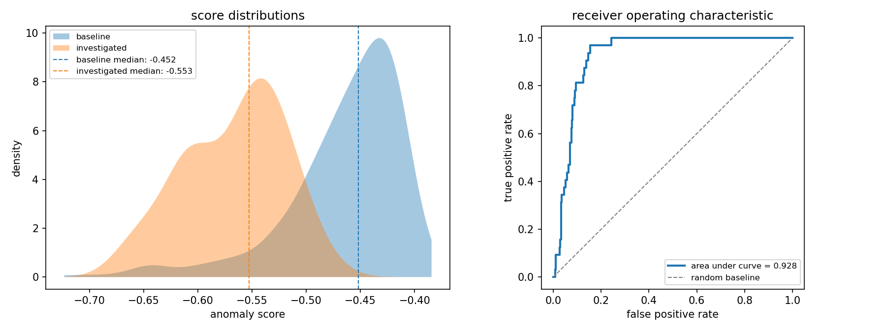
#### queenright hive 06 before 03/12 vs after 03/12 queenright
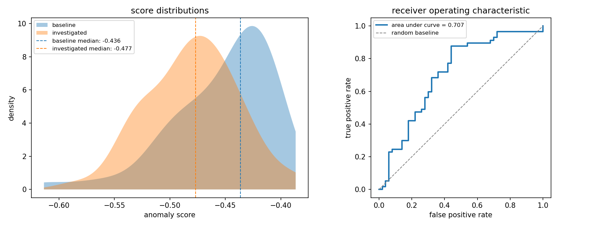

These results indicate positive detection power for the queenless state,
but in some circumstances a similar anomaly can be flagged on a perfectly queenright hive (hive 06).

### mosaic visualisation

The mosaic heatmap provides a detailed view of the anomaly:

It allows one to examine a particular hive's feature levels and anomaly score over a period,
compared against the rest of the hive population.

- **rows** = hourly observations ordered chronologically
- **columns** = features, z-scored against the queenright baseline
- **left strip** = anomaly score (darker = more anomalous, red border = bottom 1st percentile)
- **baseline panel** = the same time window aggregated across queenright hives (mean, worst, furthest from centroid, or single hive — selectable)
- **column ordering** = features reordered by similarity for visual clustering

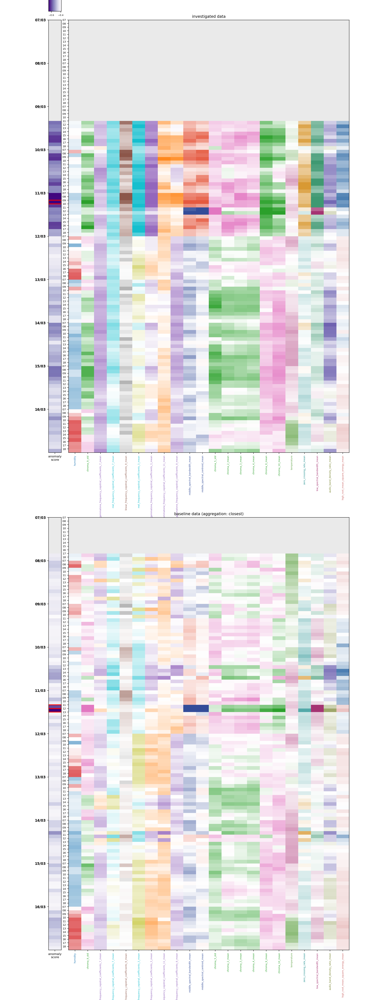

---

## spectrograms

Below are spectrograms from single files on 10 March around 10:00.
The frequencies identified as relevant in the literature are indicated on the right side of each graph.

Note that on 10 March, hive 04 was queenless.

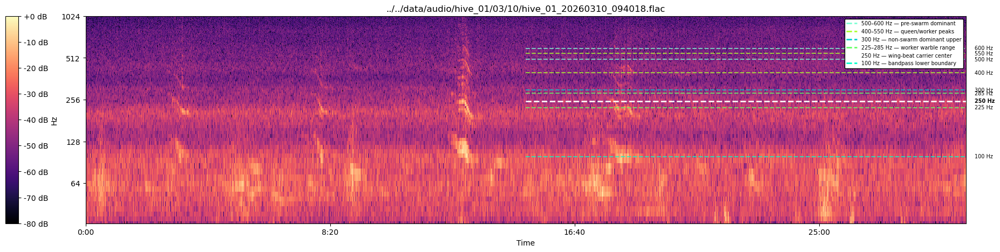
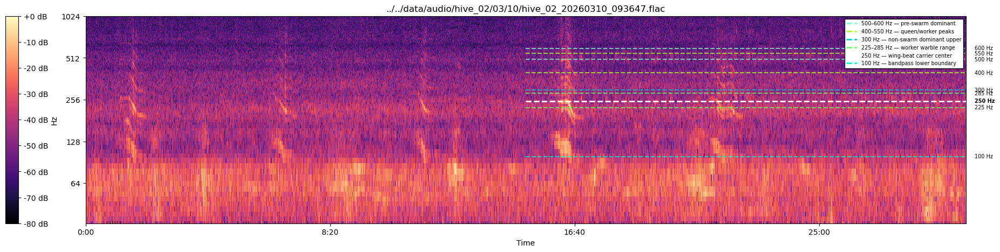
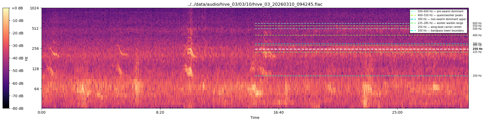
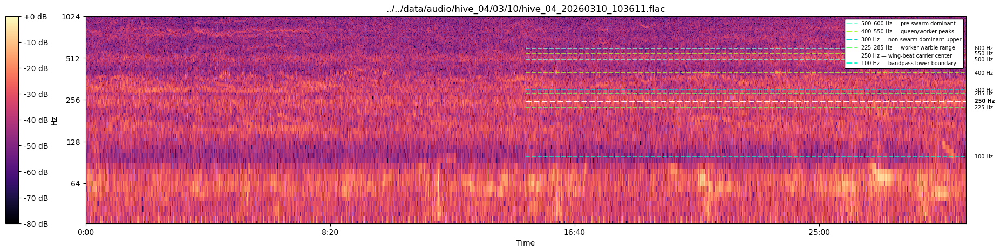
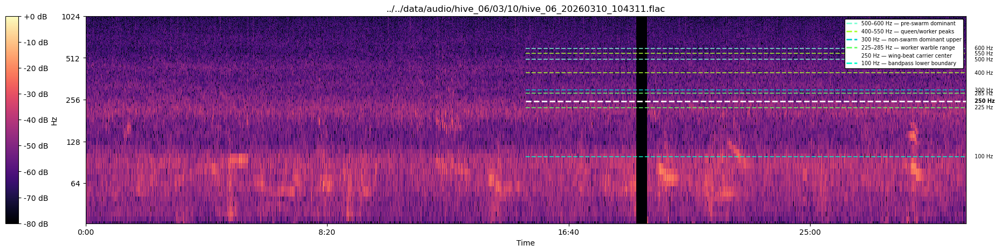
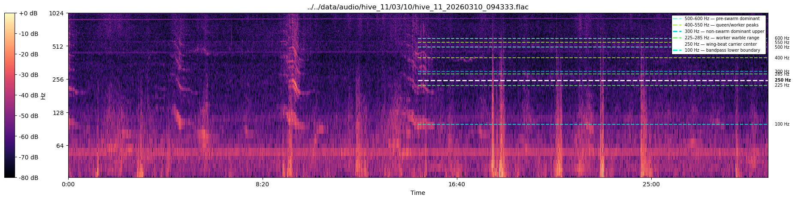

It might be tempting to attribute the peculiar spectrogram of hive 04 to queenlessness.
However, on 16 March — when hive 03 is queenless and hive 04 is queenright —
the peculiarity remains with hive 04 and does not follow the queen status.

This suggests that the distinctive spectral shape is hive-specific rather than queen-state-dependent.

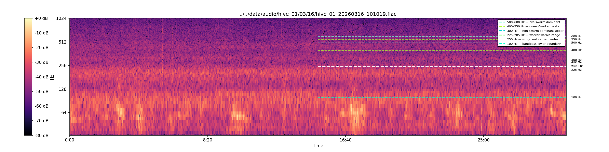
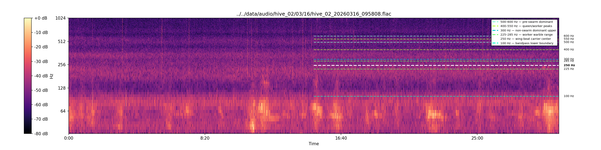
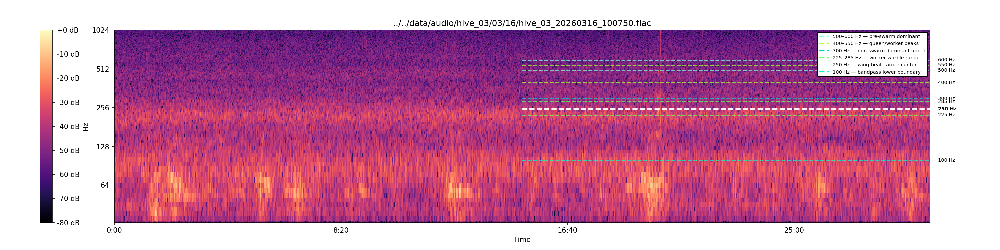
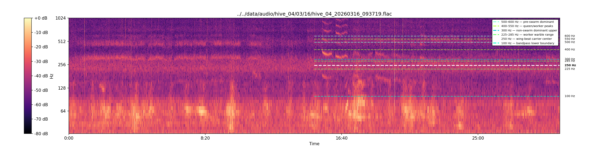

---

## findings

- **Hive 04** queenless period is well separated from the queenright baseline in the anomaly score distribution.
  The mosaic heatmap highlights which features deviate most and at which hours.
- **Hive 03** queenless period shows weaker separation, if any.
  This may reflect the colony's slower response to queen removal,
  the influence of low temperatures on bee activity, or simply a less pronounced acoustic shift.
- The **mosaic heatmap** makes it possible to identify both the temporal extent of the anomaly
  (which hours diverge) and the spectral nature of the deviation (which features shift).
- **Accelerometry alone** is not a reliable queenlessness indicator,
  but the daily in-band peak ratio shows suggestive trends that align with queen transfer timing.

---

## going further

Several avenues remain unexplored:

- **Hive 11 as a noise reference** — hive 11 is a dummy (no colony).
  Its recordings capture only environmental and structural noise.
  It could serve as a reference for more targeted denoising
  (e.g. subtracting its spectral profile from active hives),
  or as a detector of artifacts: any acoustic event present in both hive 11
  and an active hive is likely environmental rather than biological.

- **Faulty files and glitchy passages** — little care has been taken
  to detect or discard corrupted recordings, clipped segments,
  or transient hardware glitches within audio files.
  Such passages are currently averaged into the hourly feature vectors
  and may degrade both feature quality and downstream analysis.
  A dedicated quality-control step — for instance flagging frames
  whose root-mean-square energy or spectral flatness falls outside
  plausible bounds — would improve robustness.

## interactive dashboard

A Streamlit application allows interactive exploration of the anomaly detection results.
The user can select queenless hives, choose features, pick an anomaly detector,
and view discrimination plots and z-score mosaics interactively.

See [`streamlit_app.py`](https://hivenavigator-kmu6dzw2hc5huckrldvxg5.streamlit.app/) for the dashboard source.

---

